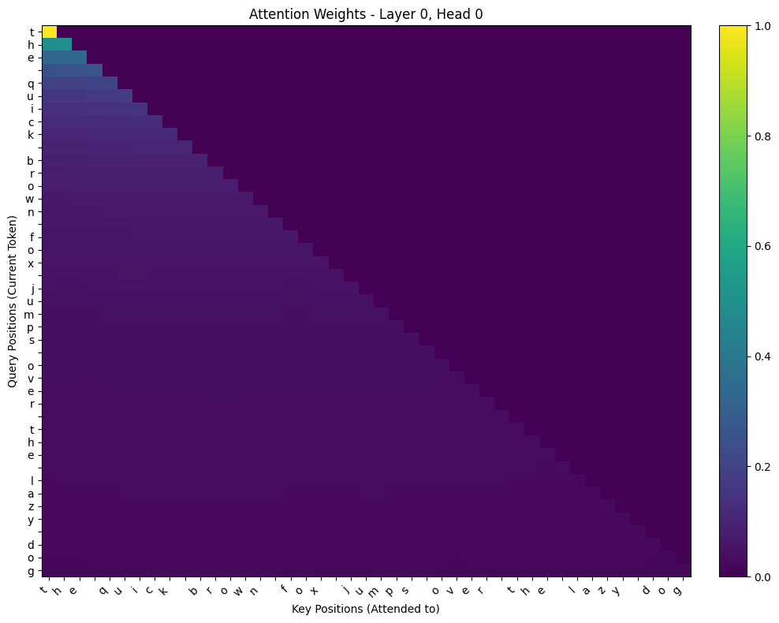
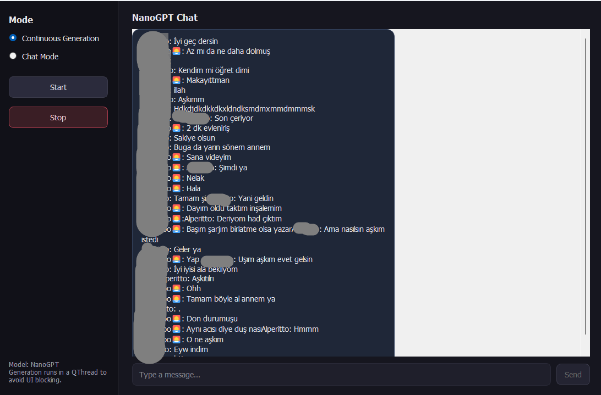

# numpy-gpt


> A GPT model built from scratch using **only NumPy and CuPy** — no PyTorch, no TensorFlow, no autograd.  
> Trained on a personal WhatsApp conversation export to mimic a real chat style.

---

## Why This Exists

Most transformer tutorials teach you how to _call_ `nn.MultiheadAttention`.  
This project teaches you what's **inside** it.

Every matrix multiply, every gradient, every Adam update — implemented by hand.  
No framework magic. No `.backward()`. Just NumPy, the chain rule, and stubbornness.

The model was trained on a personal WhatsApp chat export and left to predict  
the next character of a real conversation. Watching it hallucinate messages  
between two people it was trained on is equal parts eerie and hilarious.

---

## Architecture

Standard GPT-style (decoder-only) Transformer, built from first principles:



**Everything above — forward pass, backprop, optimizer — is implemented manually in NumPy/CuPy.**

---

## Hyperparameter Configuration

| Parameter      | Value   | Notes                             |
|----------------|---------|-----------------------------------|
| `embed_size`   | 256     | Model dimensionality              |
| `num_heads`    | 8       | Attention heads (head_dim = 32)   |
| `num_blocks`   | 4       | Transformer layers                |
| `seq_len`      | 128     | Context window (chars)            |
| `learning_rate`| 1e-4    | Adam LR                           |
| `epochs`       | 60,000  | Trained overnight on RTX 3060     |
| `beta1`        | 0.9     | Adam first moment                 |
| `beta2`        | 0.99    | Adam second moment                |
| `eps`          | 1e-8    | Adam epsilon                      |

> Config lives at the top of `train.py` in ALL_CAPS constants.  
> No YAML, no config classes — just variables at the top of the file.

---

## Tech Stack

| Component       | Tool                  | Purpose                                  |
|-----------------|-----------------------|------------------------------------------|
| Compute (CPU)   | NumPy                 | All tensor ops, default backend          |
| Compute (GPU)   | CuPy                  | Drop-in NumPy replacement for CUDA       |
| GUI             | PyQt5                 | Interactive chat window                  |
| Data            | WhatsApp `.txt` export| Training corpus — raw personal chat logs |
| Serialization   | pickle (`.pkl`)       | Saving/loading model weights             |

---

## Project Structure

```
numpy-gpt/
├── main.py           # Core model class + architecture components
├── train.py          # Training loop, hyperparameters, data loading
├── test.py           # CLI inference & text generation
├── mainwindow.py     # PyQt5 GUI for interactive chat
├── attention.py      # Multi-head causal self-attention (manual backprop)
├── transformer.py    # Transformer block (pre-norm, FFN, residuals)
├── tokenizer.py      # Character-level tokenizer
├── mhe.py            # Multi-head embedding components
├── saving.py         # Weight serialization (.pkl)
├── utils.py          # Text generation helpers
├── requirements.txt
└── .env.example      # WHATSAPP_PATH config
```

---

## Setup & Usage

### 1. Install Dependencies

```bash
pip install -r requirements.txt
```

> **GPU (recommended):** CuPy requires a CUDA-compatible GPU. Install the version matching your CUDA:
> ```bash
> pip install cupy-cuda12x  # for CUDA 12.x
> ```
> The code auto-detects CuPy availability and falls back to NumPy silently.

### 2. Configure Environment

```bash
cp .env.example .env
# Edit .env and set your WhatsApp export path:
# WHATSAPP_PATH=data/my_chat.txt
```

### 3. Export Your WhatsApp Chat

1. Open any chat in WhatsApp
2. Tap **⋮ Menu** → **More** → **Export Chat**
3. Select **Without Media**
4. Save the `.txt` file to `data/`

### 4. Train

```bash
python train.py
```

Training runs for the configured number of epochs. Weights are saved as `.pkl` files.  
On an RTX 3060, ~60k epochs takes roughly 10–12 hours overnight.

### 5. Generate Text (CLI)

```bash
python test.py
```

### 6. Generate Text (GUI)

```bash
python mainwindow.py
```

---

## Attention Visualization

Average attention weights from a trained forward pass (Layer 1).  
Shows average attention paid by each position to all other positions.


Causal self-attention weights from a trained forward pass (Layer 1, Head 1).  
Upper triangle is masked — each token can only attend to itself and previous positions.



---

## Training Details

- **Hardware:** NVIDIA RTX 3060
- **Duration:** ~12 hours (overnight run)
- **Epochs:** ~60,000
- **Dataset:** Single WhatsApp conversation export (character-level, no preprocessing beyond parsing)
- **Observation:** After enough epochs the model starts producing plausible message structures — correct sender prefixes, punctuation patterns, emoji placement — without ever being told what any of those things are.

---

## Sample Output

The model was trained on Turkish chat data. After enough epochs it learns
sender prefixes, punctuation patterns, and even emoji placement — without
being told what any of those things are.



## What This Demonstrates

- Full **forward pass** implementation: embedding → attention → FFN → logits → loss
- Full **backward pass**: manual gradient computation through every layer
- **Multi-head causal self-attention** from scratch including the causal mask
- **Adam optimizer** implemented without any library
- **CuPy/NumPy interoperability** — same codebase, GPU optional
- Training a generative character-level model on real personal data

---

## Limitations

- Character-level means slow convergence and limited coherence at scale
- No batched training (or minimal batch support) — single-sequence updates
- No gradient clipping — training can be unstable at higher LRs
- `.pkl` weight format is not portable across Python versions
- This is a learning project, not production code

---

## License

MIT